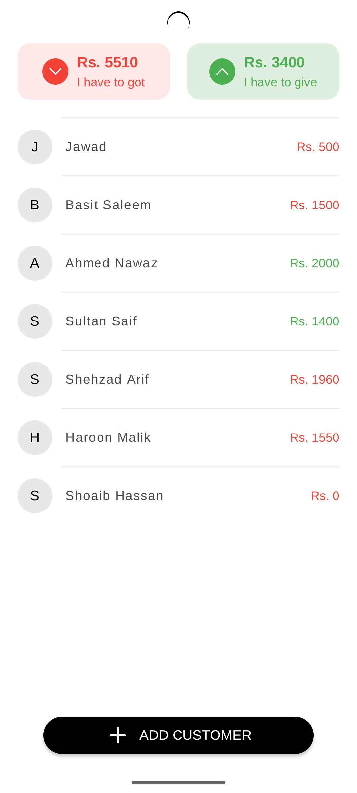
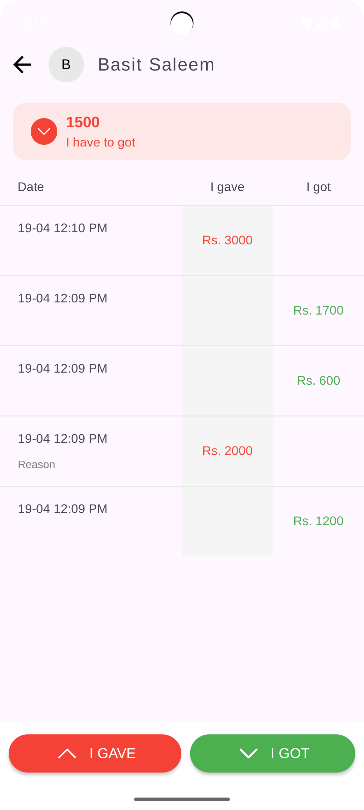
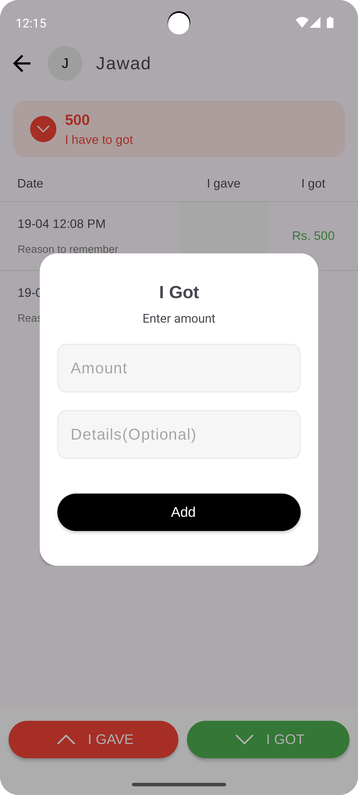
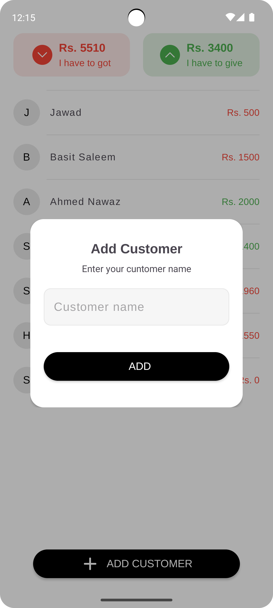

# 📘 Khata Book

**Khata Book** is a simple and efficient digital ledger app built with Kotlin using MVVM architecture and Room Database. It helps users manage customer transactions by keeping track of money given or received, along with proper date, time, and notes. This app uses modern Android development tools and follows clean architecture principles for optimal maintainability and scalability.

<a href="https://github.com/your-username/your-repo/releases/download/v1.0/khata-book-v1.0.apk" download>
  <button>
    📥 Download Khata Book APK
  </button>
</a>

---

## 🧰 Features

- 📇 **Customer Management**: Add, edit, and delete customer profiles.
- 💸 **Transaction Records**: Track money given or received with amounts and clear labels.
- 🕒 **Transaction History**: Maintain and view transactions with date, time, and details.
- 📅 **Complete Transaction History per Customer**: View detailed records for each customer.
- 📶 **Offline Support**: Works seamlessly without an internet connection using Room Database.
- 🔄 **Real-time UI Updates**: Leverages MVVM architecture for lifecycle-aware, reactive UI.

---

## 🛠️ Built With

- **Kotlin**: The modern, statically-typed programming language for Android.
- **MVVM Architecture**: Helps separate concerns, making code maintainable and testable.
- **Room Database**: Local storage to persist data offline and manage the database efficiently.
- **LiveData & ViewModel**: Lifecycle-aware components that ensure the UI is always up to date.
- **Coroutines**: Asynchronous programming for smooth background operations.

---

## 📱 Screenshots

| Splash Screen | Customer List | Add Transaction |
|-------------|----------------|------------------|
|  |  |  |

| Add New Customer | Add New Transaction |
|------------------------|------------------------|
|  |  |

---

## 🧑‍💻 Usage

### ➕ Add a Customer
Navigate to the customer list screen. Tap the **"Add Customer"** button and fill out the details.

### 💸 Record a Transaction
In the customer details screen, input the amount and specify whether the transaction was money **given or received**.

### 📅 View Transaction History
Check each customer's full transaction history, including **dates** and **amounts**.

### ✏️❌ Edit or Delete Customers/Transactions
Modify or delete any customer or transaction record by swipe-left to item in the list.

---

## 📖 How It Works

### 🧱 MVVM Architecture
The app follows the **Model-View-ViewModel (MVVM)** architecture for separation of concerns and better maintainability:

- **Model**: The data classes (`Customer` and `Detail`) represent the customer profiles and transaction records.
- **View**: The UI is handled by the Activities and Fragments, displaying the data dynamically.
- **ViewModel**: Acts as a communication bridge between the UI and the repository, ensuring the UI updates in response to data changes.

### 💾 Room Database
Room provides a clean API to interact with the SQLite database.

- Customer data and transaction details are stored **locally** for offline use and are persistent across sessions.

### 🔄 Coroutines
The app uses **Kotlin Coroutines** to perform database operations asynchronously, ensuring smooth and responsive user experience.

